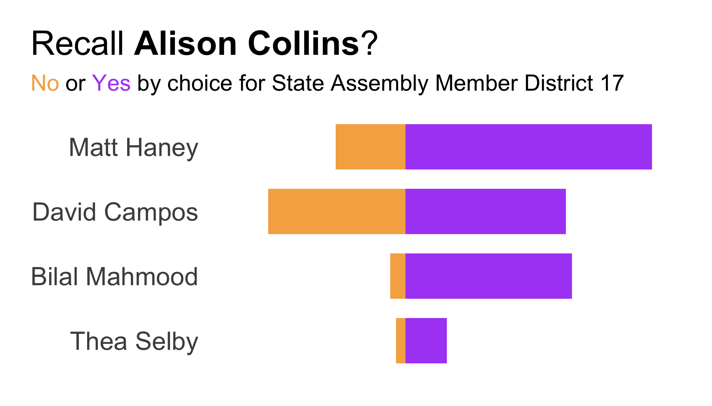
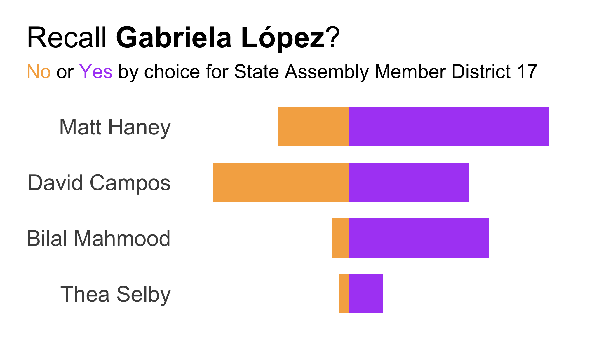
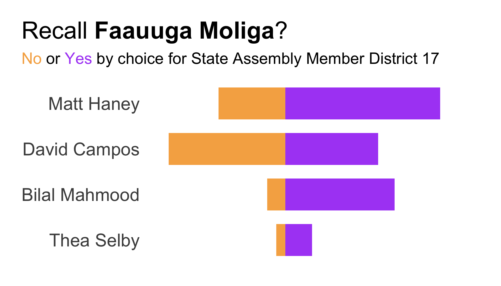

# sf-election-2022-02

Results from the San Francisco election on Feb. 15, 2022

## Raw data

Election data is made available by the San Francisco Department of Elections: [https://sfelections.sfgov.org/february-15-2022-election-results-detailed-reports](https://sfelections.sfgov.org/february-15-2022-election-results-detailed-reports)

Raw ballot data is available under Preliminary Report 3 in "Cast Vote Record (Raw data) - JSON".

## Tidy data

`get-ballots.py` loads and processes the raw JSON data and returns a tidy CSV called `ballots.csv`.

## Visualizations

`plot-ballots.R` makes a few exploratory plots from the data in `ballots.csv`.

